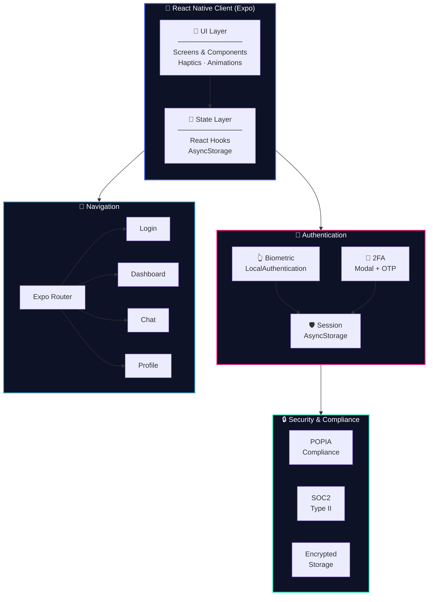
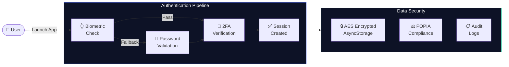
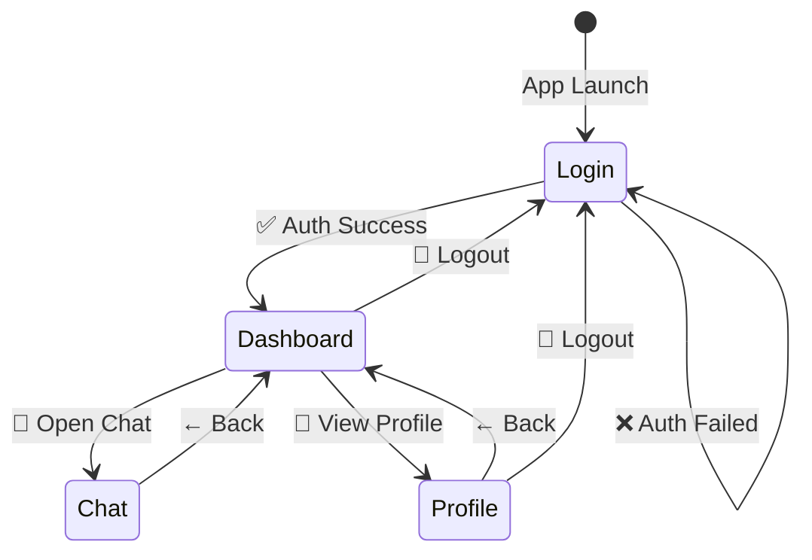
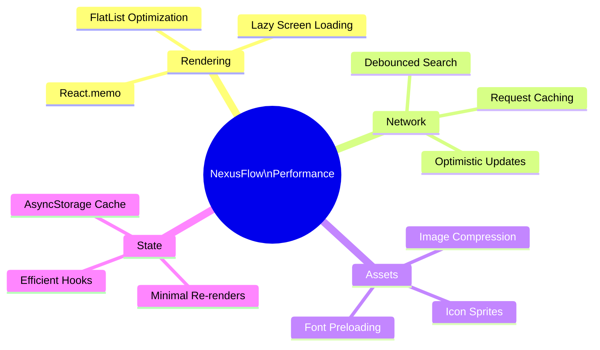

<div align="center">

<!-- Animated Header Banner -->


<!-- Typing Animation -->
<a href="https://github.com/LuthandoCandlovu/nexusflow">
  
</a>

<br/><br/>

<!-- Badges Row 1 -->
[](https://github.com/LuthandoCandlovu/nexusflow/stargazers)
[](https://github.com/LuthandoCandlovu/nexusflow/network)
[](https://opensource.org/licenses/MIT)
[](http://makeapullrequest.com)

<!-- Badges Row 2 -->


</div>

---

## 📱 App Preview

<div align="center">
<table>
  <tr>
    <td align="center"><b>🔐 Login Screen</b></td>
    <td align="center"><b>📊 Dashboard</b></td>
    <td align="center"><b>💬 Chat Screen</b></td>
    <td align="center"><b>👤 Profile</b></td>
  </tr>
  <tr>
    <td></td>
    <td></td>
    <td></td>
    <td></td>
  </tr>
</table>
</div>

---

## 🏗️ System Architecture



### 🔐 Security Architecture



### 🧭 Navigation Flow



---

## 🎨 Design System

<div align="center">

| Swatch | Variable | Hex | Purpose |
|--------|----------|-----|---------|
| 🟦 | `primary` | `#4361EE` | Trust & Innovation |
| 🟥 | `secondary` | `#F72585` | Energy & Creativity |
| 🔵 | `accent` | `#4CC9F0` | Clarity & Communication |
| 🟩 | `success` | `#06D6A0` | Growth & Confirmation |
| 🟨 | `warning` | `#FFB703` | Attention & Alerts |
| 🔴 | `error` | `#E63946` | Urgency & Errors |

</div>

```javascript
const COLORS = {
  primary:   '#4361EE',  // 🟦 Trust & Innovation
  secondary: '#F72585',  // 🟥 Energy & Creativity
  accent:    '#4CC9F0',  // 🔵 Clarity & Communication
  success:   '#06D6A0',  // 🟩 Growth
  warning:   '#FFB703',  // 🟨 Attention
  error:     '#E63946',  // 🔴 Urgency
  dark:      '#1E1E2E',  // ⬛ Premium
  light:     '#F8F9FF',  // ⬜ Clean
};
```

---

## ✨ Features

<div align="center">

| 🔐 Security | 💬 Communication | 📊 Management | 🎯 UX |
|------------|-----------------|---------------|-------|
| Biometric Login | Real-time Chat | Team Dashboard | Haptic Feedback |
| Two-Factor Auth | Message Reactions | Role-Based Access | Pull to Refresh |
| POPIA Compliant | Reply to Messages | Activity Logs | Dark / Light Mode |
| Encrypted Storage | File Sharing | Meeting Scheduler | Smooth Animations |
| Session Management | Online Indicators | Task Tracking | Loading States |

</div>

---

## ⚡ Performance Optimizations



---

## 📁 Project Structure

```
nexusflow/
├── 📂 app/                     # Expo Router screens
│   ├── _layout.tsx             # Root navigation layout
│   ├── index.tsx               # 🔐 Login screen
│   ├── dashboard.tsx           # 📊 Dashboard screen
│   ├── chat.tsx                # 💬 Chat screen
│   └── profile.tsx             # 👤 Profile screen
│
├── 📂 components/              # Reusable UI components
│   ├── Button/
│   ├── Card/
│   └── Modal/
│
├── 📂 hooks/                   # Custom React hooks
│   ├── useAuth.ts
│   ├── useChat.ts
│   └── useTheme.ts
│
├── 📂 utils/                   # Helper functions
├── 📂 constants/               # App constants & colors
├── 📂 assets/                  # Images, icons, fonts
│
├── app.json                    # Expo configuration
├── package.json                # Dependencies
└── README.md                   # This file
```

---

## 🚀 Getting Started

### Prerequisites


### Installation

```bash
# 1. Clone the repository
git clone https://github.com/LuthandoCandlovu/nexusflow.git
cd nexusflow

# 2. Install dependencies
npm install

# 3. Start the development server
npx expo start
```

### Run on Your Device

| Platform | Command | Method |
|----------|---------|--------|
| 🤖 Android | Press `a` | Android Emulator |
| 🍎 iOS | Press `i` | iOS Simulator |
| 🌐 Web | Press `w` | Browser |
| 📱 Physical | Scan QR | Expo Go App |

---

## 🔑 Demo Credentials

> ⚠️ **For testing only** — change before deploying to production.

| Role | Email | Password |
|------|-------|----------|
| 👑 **Admin** | `admin@nexusflow.com` | `Admin123!` |
| 👤 **User** | `user@nexusflow.com` | `User123!` |

---

## 🧪 Development Scripts

```bash
npm test          # Run test suite
npm run lint      # Lint source code
npm run format    # Format with Prettier
npx expo start    # Start dev server
npx expo build    # Production build
```

---

## 🤝 Contributing

Contributions are welcome! Here's how:

```bash
# 1. Fork the repository on GitHub

# 2. Create your feature branch
git checkout -b feature/AmazingFeature

# 3. Commit your changes
git commit -m 'feat: Add AmazingFeature'

# 4. Push to your branch
git push origin feature/AmazingFeature

# 5. Open a Pull Request on GitHub
```

> Please follow [Conventional Commits](https://www.conventionalcommits.org/) for commit messages.

---

## 📞 Contact & Support

<div align="center">

| Channel | Contact |
|---------|---------|
| 📧 **Email** | [sales@nexusflow.com](mailto:sales@nexusflow.com) |
| 🐦 **Twitter** | [@nexusflow](https://twitter.com/nexusflow) |
| 💼 **LinkedIn** | [NexusFlow](https://linkedin.com/company/nexusflow) |
| 🌐 **Website** | [www.nexusflow.com](https://www.nexusflow.com) |
| 🐛 **Issues** | [GitHub Issues](https://github.com/LuthandoCandlovu/nexusflow/issues) |

</div>

---

## 👨‍💻 Developer

<div align="center">


### Luthando Candlovu

[](https://github.com/LuthandoCandlovu)
[](https://linkedin.com)
[](https://twitter.com)


</div>

---

## 📄 License

This project is licensed under the **MIT License** — see the [LICENSE](LICENSE) file for details.

---

## ⭐ Star History

<div align="center">
  <a href="https://star-history.com/#LuthandoCandlovu/nexusflow&Date">
    
  </a>
</div>

---

<!-- Animated Footer -->
<div align="center">


**© 2026 NexusFlow Technologies. All rights reserved.**

`SOC2 Type II` • `POPIA Compliant` • `MIT Licensed`

[](https://github.com/LuthandoCandlovu/nexusflow)
[](https://github.com/LuthandoCandlovu/nexusflow/network)
[](https://github.com/LuthandoCandlovu/nexusflow/watchers)

</div>
